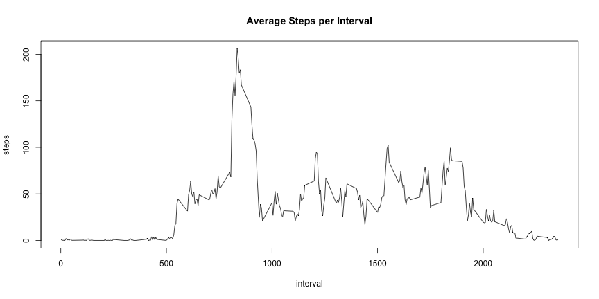
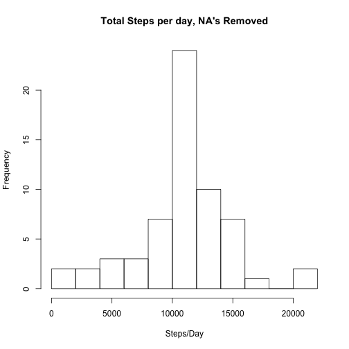
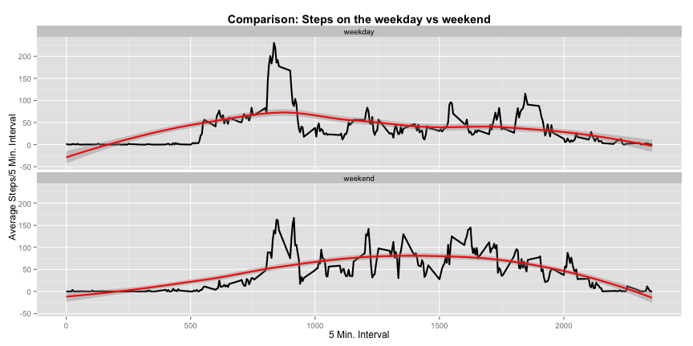

## Reproducible Research Peer Assignment 1: Activity Monitor Data
by Frank Shuster

### Loading and preprocessing the data
We are assuming that the data is already in the working directory and does not need to be input from an external source.  We are using the plyr and ggplot2 packages in this report.  Finally in this section we convert the date field from character to date format. 


```r
library(plyr)
library(ggplot2)
activity <- read.csv("./data/activity.csv")
activity$date <- as.Date(activity$date)
```

### What is mean total number of steps taken per day?
To get to this answer we are aggregating the activity datset on date while summing steps resulting in a table called total steps.  We then determine the median and mean values to obtain the mean and median daily step statistics.


```r
totalsteps <- aggregate(steps ~ date, data = activity, sum, na.action = na.omit)

meansteps <- mean(totalsteps$steps)
mediansteps <- median(totalsteps$steps)
```

The mean total number of steps taken per day is 1.0766189 &times; 10<sup>4</sup>
The median total number of steps taken per day is 10765

Below is a histogram of the total steps taken per day

```r
hist(totalstepsnona$steps, breaks = 10,
     main = "Total Steps per Day",
     xlab = "Steps/Day")
```

```
## Error in hist(totalstepsnona$steps, breaks = 10, main = "Total Steps per Day", : object 'totalstepsnona' not found
```

### What is the average daily activity pattern?

To determine the average daily activity pattern we first calculated the mean steps per 5 min interval in a table called "meanbyinterval".

```r
meanbyinterval <- aggregate(steps ~ interval, data = activity, mean, na.action = na.omit)
```

Next we show a plot of the average steps per interval for all intervals.


```r
plot(meanbyinterval, type = "l",
     main = "Average Steps per Interval")
```

 

```r
maxsteps <- meanbyinterval$interval[meanbyinterval$steps == max(meanbyinterval$steps)]
```
From this data we determined the interval with the most steps to be 835.

### Imputing missing values

First I created a separate data frame to manage imputing the NA's.

```r
activitynona <- activity
activitynona <- merge(activitynona, meanbyinterval, by = "interval")
names(activitynona) <- c("interval","steps", "date", "meansteps")
```
My strategy for imputing the NA's was simple and direct.  Since NA's only appear in the steps field, my strategy was simply to replace the NA with the average (mean) value of steps on that day. 

```r
for(i in 1:length(activitynona$steps)){
  if (is.na(activitynona$steps[i] == TRUE)) activitynona$steps[i] <- activitynona$meansteps[i] 
}

# Sum the total steps on a given date
totalstepsnona <- aggregate(steps ~ date, data = activitynona, sum)

# take the mean & median of those sums
meanstepsnona <- mean(totalstepsnona$steps)
medianstepsnona <- median(totalstepsnona$steps)

# Histogram of total steps taken each day

hist(totalstepsnona$steps, breaks = 10,
    main = "Total Steps per day, NA's Removed",
    xlab = "Steps/Day")
```

 

Imputing the NA's by using the mean for that day increased the bar height in the histogram, which makes sense because there are now more values in the dataset.  Also, the shape did not change implying that the mean/median did not change.  I check this and 

  - The mean total number of steps taken per day with NA's is 1.0766189 &times; 10<sup>4</sup>; without NA's the mean is 1.0766189 &times; 10<sup>4</sup>.
  - The median total number of steps taken per day with NA's is 10765; without NA's the median is 1.0766189 &times; 10<sup>4</sup>.
  
Both mean and median are virtually unchanged.

### Are there differences in activity patterns between weekdays and weekends?

For this section, I identified the days that were weekday and weekend and segregated the interval data in 2 plots to compare step activity during weekdays and weekends. 


```r
for (i in 1:length(activitynona$date)) {
  if (weekdays(activitynona$date[i]) == "Sunday" | weekdays(activitynona$date[i]) == "Saturday") {
    activitynona$timeofweek[i] <- "weekend"
  } else {
    activitynona$timeofweek[i] <- "weekday"
  }
}

activitynona$timeofweek <- as.factor(activitynona$timeofweek)

avgstepsnona <- aggregate(activitynona$steps, by = list(activitynona$timeofweek,activitynona$interval),data = activitynona, mean)


names(avgstepsnona) <- c("timeofweek","interval","meansteps")

# Make Plot

ggplot(avgstepsnona, aes(x=interval, y=meansteps)) + 
  geom_line(size = 1, colour = "black") +
  geom_smooth(size = 1, colour = "red", method = "loess") +
  facet_wrap(~timeofweek, nrow = 2) +
  xlab("5 Min. Interval") +
  ylab("Average Steps/5 Min. Interval") +
  ggtitle("Comparison: Steps on the weekday vs weekend") +
  theme(plot.title = element_text(face = "bold"))
```

 

This chart shows the comparison of steps taken during weekend days vs steps taken on weekdays.  Initially the line chart was difficult to interpret but the addition of a loess smoothing curve shows some similarities and differences between weekend and weekday walking activity.

Observations:
  - There is a spike of step activity in the morning hours between 8 and 9:30, but the spike is larger on weekdays.  This could be because of walking/traveling to work or school
  - The Loess curve really helps point out that there is a larger amount of activity (steps) during the weekend afternoon timeframe than during the weekday.  This could be because the people in this study were workers or students and were sitting most of the workday time period (i.e. 9 - 5)
  - It appears there are more steps taken during the evening hours on the weekend than during the weekday, but this difference is smaller.  People go out more on the weekend than during the week so this could be the cause of this.
